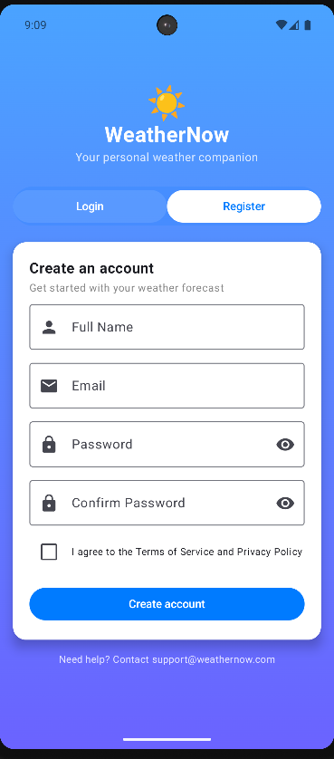

# ☀️ WeatherNow

**Your Personal Weather Companion: Reliable, Instant Forecasts Built with Modern Android Tech.**

[](https://github.com/MohamedAta575/WeatherNow/stargazers)
[](https://github.com/MohamedAta575/WeatherNow/blob/main/LICENSE)

**Weather Now** is a modern Android app that lets you check the weather anywhere—either by searching for a location or using your current location via the **"Use Current Location"** button. Stay updated with real-time weather data and forecasts for the next seven days.

---

## 📸 Screenshots

| Search & Popular Cities | Weather Details & Forecast |
| :----------------------: | :-----------------------: |
|  |  |
|  |  |
|  |  |

---

## 🎥 Video Demo

Watch a quick demonstration of the app's user interface and core features:

[](https://www.youtube.com/shorts/dG0z4xN7_vs)

---

## 🚀 Features

- 🔍 **Search weather** for any location.
- 📍 **Use current location** for instant local weather.
- 📅 View daily and **7-day weather forecasts**.
- 🔔 **Dynamic notifications** that update automatically based on the time of day.
- 💾 Persistent user login and data storage using **DataStore**.
- 🛡 **Clean Architecture and MVI pattern** for maintainable code.
- 🔧 **Dependency Injection** with **Hilt** for scalable development.

---

## 🛠 Tech Stack

| Category | Technologies |
| :--- | :--- |
| **Language & UI** | **Android** (Kotlin), **Jetpack Compose** |
| **Architecture** | **Clean Architecture & MVI Pattern** |
| **Networking** | **Retrofit** (Weather API integration) |
| **Backend & Storage** | **Firebase** (Authentication), **DataStore** (User Preferences) |
| **Dependency Injection** | **Hilt** |
| **Background Tasks** | Dynamic Notifications |

---

## ⚙️ Requirements

- **Android Studio** (latest version)
- Android device or emulator
- **Weather API key** (must be added in `local.properties`)
- **Firebase Project** configured for Android.

---

## ▶️ How to Run

1.  **Clone the repository:**
    ```bash
    git clone https://github.com/MohamedAta575/WeatherNow.git
    ```

2.  **Configure API Key:**
    * Create a file named **`local.properties`** in the root directory.
    * Add your API key:
        ```properties
        WEATHER_API_KEY="YOUR_API_KEY_HERE"
        ```

3.  **Setup Firebase:**
    * Create and configure a **Firebase Project** for your Android application.
    * Download the **`google-services.json`** file and place it in the **`app/`** directory.

4.  **Run the App:**
    * Open the project in Android Studio, sync Gradle, and run on a device/emulator.

---

## 📜 License

Distributed under the **MIT License**. See the [LICENSE](https://github.com/MohamedAta575/WeatherNow/blob/main/LICENSE) file for more information.
